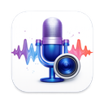

<p align="center">
  
</p>

<h1 align="center">AudioCaptor</h1>

<p align="center">
  <strong>Портативний записувач системного звуку для Windows</strong>
</p>

<p align="center">
  Записуйте мікрофон, системний звук або обидва — з гнучкими режимами виведення.<br>
  Не потребує встановлення. Просто запустіть exe-файл.
</p>

<p align="center">
  <a href="README.md">English</a> · Українська
</p>

---

## Можливості

- **Запис системного звуку (loopback)** — записуйте те, що чуєте через динаміки
- **Запис мікрофона** — захоплюйте звук з будь-якого під'єднаного мікрофона
- **Мікшування в реальному часі** — поєднуйте мікрофон і системний звук з регулюванням гучності
- **Кілька режимів виведення** — Мікрофон, Системний звук, Мікс, Мікс + Мікрофон, Мікс + Системний, Окремі файли
- **Профілі запису** — зберігайте папку, режим, частоту дискретизації, гучність і шаблони назв файлів для кожного профілю
- **Глобальна гарячою клавіша** — старт, пауза та зупинка запису з будь-якого вікна (за замовчуванням: `Pause/Break`)
  - Короткий натиск: старт / пауза / продовження
  - Довгий натиск (≥500 мс): зупинка і збереження
- **Системний трей** — згортайте в трей, керуйте записом з меню трея
- **Звукові сповіщення** — звуковий зворотний зв'язок при старті, паузі та зупинці
- **Теми** — Авто, Світла та Темна
- **Інтернаціоналізація** — англійська та українська
- **Портативний** — один `.exe` файл, усі дані зберігаються в папці `AudioCaptor-data/`
- **Доступний** — повна підтримка скрінрідерів, клавіатурна навігація, ARIA-мітки
- **WAV-вихід** — запис без втрат на частотах 8, 16, 44.1 або 48 кГц

## Швидкий старт

1. Завантажте `AudioCaptor.exe`
2. Помістіть у будь-яку папку (наприклад, `C:\Tools\AudioCaptor\`)
3. Запустіть

При першому запуску AudioCaptor створить таку структуру поруч з exe:

```
AudioCaptor.exe
AudioCaptor-data/
├── settings.json      # Ваші налаштування (зберігаються автоматично)
├── logs/              # Діагностичні логи
└── Recordings/        # Папка для записів за замовчуванням
```

## Використання

1. **Оберіть пристрої** — виберіть мікрофон та/або системний аудіопристрій зі списків
2. **Налаштуйте профіль** — оберіть режим виведення, частоту дискретизації, рівні гучності та папку
3. **Натисніть Запис** — або використайте глобальну гарячу клавішу (`Pause/Break` за замовчуванням)
4. **Пауза / Продовження** — короткий натиск гарячої клавіші або кнопки в інтерфейсі
5. **Зупинка** — довгий натиск гарячої клавіші (≥500 мс) або натисніть Стоп

Записи зберігаються як WAV-файли з автоматичними мітками часу (наприклад, `mix_2026-03-31_14-30-00.wav`).

## Клавіатурні скорочення

| Скорочення | Дія |
|------------|-----|
| `Pause/Break` | Глобальна гаряча клавіша — старт / пауза / зупинка запису |
| `Alt+S` | Почати запис |
| `Alt+P` | Призупинити запис |
| `Alt+R` | Продовжити запис |
| `Alt+T` | Зупинити запис |
| `Alt+I` | Оголосити поточний статус (для скрінрідерів) |
| `Tab` | Навігація між елементами інтерфейсу |
| `Escape` | Закрити діалог / згорнути в трей |

Глобальна гаряча клавіша працює навіть коли AudioCaptor не у фокусі. Змінити її можна в Налаштуваннях.

## Системні вимоги

- **ОС**: Windows 10 або новіше
- **Середовище**: WebView2 (попередньо встановлено на Windows 11; доступне на більшості машин з Windows 10)
- **Аудіо**: Щонайменше один пристрій введення або виведення звуку
- **Диск**: ~10 МБ для виконуваного файлу; місце для записів залежить від тривалості та частоти дискретизації

## Встановлення через Scoop

AudioCaptor доступний через [Scoop](https://scoop.sh/), пакетний менеджер для Windows:

```powershell
scoop bucket add ruslan-rv-ua https://github.com/ruslan-rv-ua/scoop-bucket
scoop install audiocaptor
```

При встановленні через Scoop папка `AudioCaptor-data/` автоматично зберігається між оновленнями.

## Доступність

AudioCaptor створено з пріоритетом на доступність:

- Кожен елемент інтерфейсу має мітки для скрінрідерів (NVDA, JAWS, Narrator)
- Повна клавіатурна навігація — миша не потрібна
- Звукові сповіщення дублюють візуальні зміни стану
- Глобальна гаряча клавіша працює з будь-якого застосунку
- `Alt+I` оголошує поточний статус запису
- Діалог «Про програму» з довідкою по гарячих клавішах та швидким стартом

## Ліцензія

[MIT](LICENSE)

## Розробка

Див. [DEVELOPMENT.md](DEVELOPMENT.md) — інструкції зі збирання та огляд архітектури.
